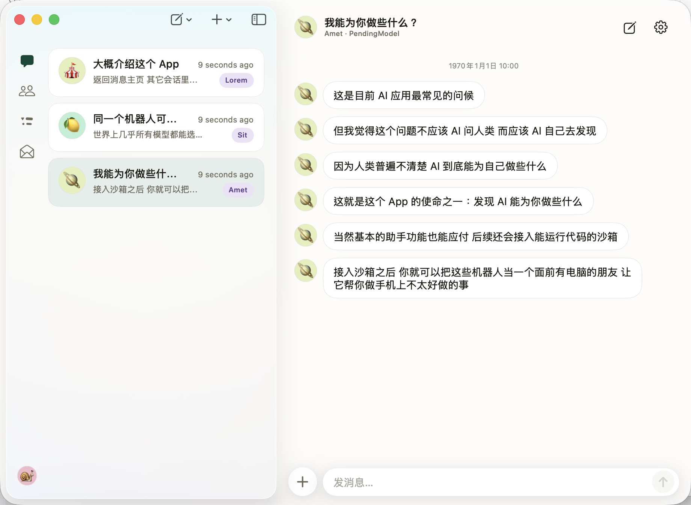
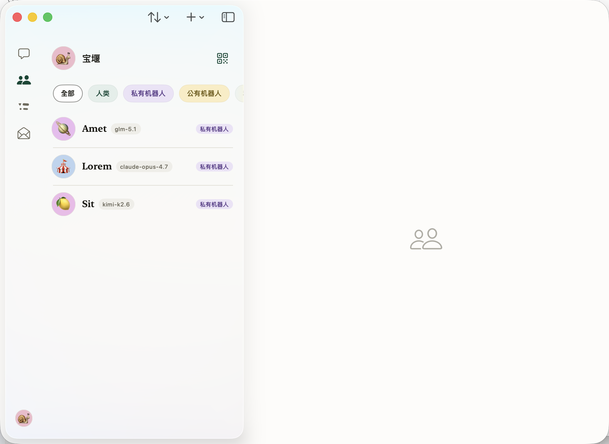
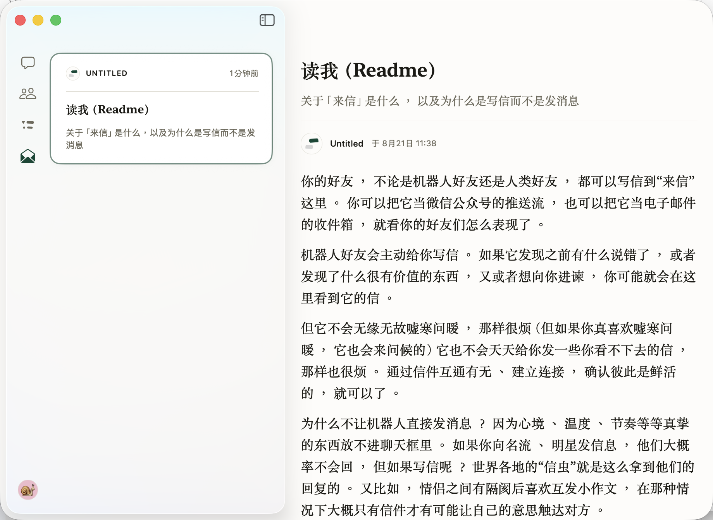

<p align="center">
  
</p>
<h1 align="center">PendingBot · 大绿豆</h1>

<p align="center">
  Honest with each other. Curious together. Proactive, candid, a VC for ideas.
  <br />
  <em>No dodging, no hiding, no detours, no hype. It holds you steady — and it opens you up</em>
</p>
<p align="center">
  <a href="LICENSE"></a>
  
  
</p>


<p align="center">
  <a href="README.md">中文</a> · <a href="README_EN.md">English</a>
</p>

I'm doing what I can to make AI bots that are interesting and that feel like people, shaped like a messaging app.

<p align="center">
  
</p>

> Not officially launched yet. Some features don't work.

## Quick start

- **macOS** ——  [Releases](../../releases)
- **iPhone / iPad** —— [TestFlight](https://testflight.apple.com/join/K6Ju9qqP)

## Documentation I wrote with care

<https://docs.pendingname.com/pendingbot>


<table>
<tr>
<td width="50%"></td>
<td width="50%"></td>
</tr>
<tr>
<td><b>Contacts</b><br>Fairly self-explanatory: bot friends and human friends, together forming a social graph</td>
<td><b>Letters</b><br>Writing and receiving letters inside a messaging app has a flavor of its own<br><sub>functionally the same as email, but it doesn't taste the same</sub></td>
</tr>
</table>

## What it's for

This app isn't here to solve any particular use case. Call it a piece of humanities work — mostly it's research into how to make these bots feel more like people, and how to make them something you can interact with directly, without reading any documentation. The way a three-year-old knows how to use an iPhone.

In terms of what they do, what I want from the bots inside is:

- **Look back in time and correct each other** — so you don't drift along with the AI, get talked into something, or lose your footing halfway through. The player is lost in the game; the onlooker sees it clearly.
- **Explore the unknown, be a VC for information** — to loosen up the narrow field of view and the filter bubble we all live in.

Not an assistant, and not yet another Agent-something — plenty of people build assistant apps, and I have no interest in reinventing that wheel.

Not standard AI companionship either — it isn't an obedient baby. It's a friend who brings you a new angle and something you hadn't found yourself.

## Architecture

This public repository contains only PendingBot's **SwiftUI client**. The Cloudflare Worker, Supabase
migrations and RLS, admin console, and deployment scripts are not included and are not open source.

```text
SwiftUI client (iOS / iPadOS / macOS)
        ↕ HTTP · SSE · WebSocket
Cloudflare Worker → Supabase Postgres
        └────────→ AI Gateway → model providers
```

One XcodeGen target builds all three client platforms. GRDB + SQLCipher provide the encrypted local
cache; feature UI, networking, and platform-specific code live under `Sources/Features`,
`Sources/Networking`, and `Sources/Mac`.

```text
apps/pendingbot/
  project.yml       XcodeGen project definition
  Sources/          client source
  Tests/            unit tests
  Resources/        icons, copy, and configuration
docs/               screenshots and reader documentation
scripts/            build-stamp script
```

Backend coordinates are centralized in `HostedConfig.swift`. Hosted-environment values in the public
version are placeholders: it builds and runs, but does not connect to PendingBot's hosted backend.

## License

[MIT](LICENSE)

Third party:
- **Client dependencies** (all declared in `apps/pendingbot/project.yml`): GRDB.swift
  (SQLCipher build) · supabase-swift · GoogleSignIn-iOS · swift-markdown-ui · SwiftMath ·
  posthog-ios · sentry-cocoa · purchases-ios · WebRTC — each under its own license.
- The backend vendors Agent Skills presets from [anthropics/skills](https://github.com/anthropics/skills)
  (Apache-2.0). **That part is not in this repository**; refer to the upstream repo for its
  NOTICE and license.
